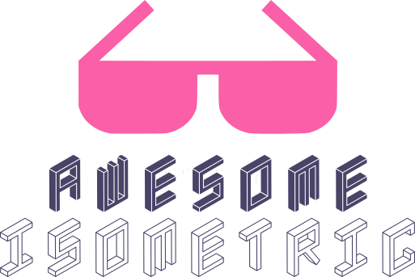

<!-- title -->

<!--lint ignore no-dead-urls-->

# Awesome Isometric  

<!-- subtitle -->

A curated list of isometric resources.

<!-- image -->

<!-- description -->

<!-- TOC -->

## Contents

- [Graphic Resources](#graphic-resources)
- [Diagram](#diagram)
- [Follow](#follow)

<!-- CONTENT -->

## Graphic Resources

- [IsoFlat](https://isoflat.com) - Isometric and flat graphic resources.

## Diagram

- [CloudCraft](https://www.cloudcraft.co/) - Online Isometric AWS Architecture diagramming tool.

<!-- END CONTENT -->

## Follow

<!-- list people worth following on social sites (Twitter, LinkedIn, GitHub, YouTube etc.) -->

Who else should we be following!?

## Contributing

[Contributions of any kind welcome, just follow the guidelines](contributing.md)!

### Contributors

[Thanks goes to these contributors](https://github.com/mipmip/awesome-isometric/graphs/contributors)!
